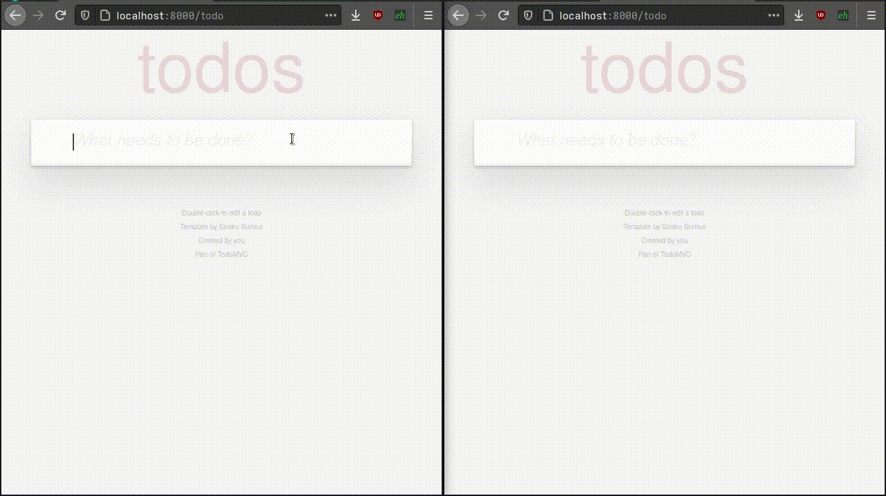

.. Django Reactor documentation master file, created by
   sphinx-quickstart on Mon Apr 12 08:53:15 2021.
   You can adapt this file completely to your liking, but it should at least
   contain the root `toctree` directive.

Welcome to Django Reactor's documentation!
==========================================

Overview
--------

Reactor enables you to do something similar to `Phoenix framework LiveView`_,
but for `Django Channels`_.

.. _Phoenix framework LiveView: https://www.phoenixframework.org/
.. _Django Channels: https://channels.readthedocs.io

Features:

- Allow to create interactive single-page-like applications while leveraging
  the server and not strictly requiring a reactive front-end framework.

What's in the box?
~~~~~~~~~~~~~~~~~~

This is no replacement for VueJS or ReactJS, or any JavaScript but it will
allow you use all the potential of Django to create interactive front-ends.
This method has its drawbacks because if connection is lost to the server the
components in the front-end go busted until connection is re-established.  But
also has some advantages, as everything is server side rendered the interface
comes already with meaningful information in the first request response, you
can use all the power of Django template without limitations, if connection is
lost or a component crashes, the front-end will have enough information to
rebuild their state in the last good known state.

.. toctree::
   :maxdepth: 2
   :glob:
   :caption: Contents:

   install
   settings
   templates
   api/*

Development & Contributing
==========================

Clone the repo and create a virtualenv or any other contained environment, get
inside the repo directory, build the development environment and the run
tests::

  git clone git@github.com:edelvalle/reactor.git
  cd reactor
  make install
  make test

If you want to run the included Django project used for testing do::

  make
  cd tests
  python manage.py runserver

Enjoy!

Indices and tables
==================

* :ref:`genindex`
* :ref:`modindex`
* :ref:`search`
